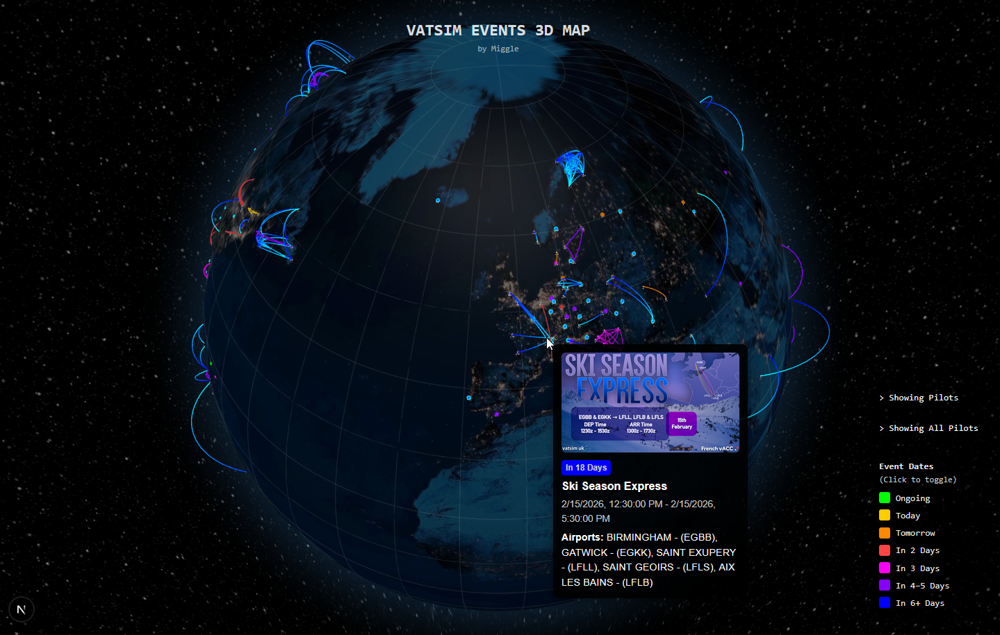

# VATSIM Events Map

This map serves as an alternate to the official 2D VATSIM events map. It offers a more visually responsive interface with the ability to filter by event day. The project aims to bridge the current data visualisation gap between VATSIM members and a convenient and effective viewing medium.

Access the website at [https://vatsim-events-map.vercel.app/](https://vatsim-events-map.vercel.app/).

## Features
- Interactive (Click & Drag)
- Tooltips (Hover)
    - Includes scheduled event times, dates, and ICAOs.
- Filters (Time-based)
- Live pilot display w/ event filter
- Day/Night Toggle
- Mobile Compatability




## Project Architecture

This is a [Next.js](https://nextjs.org) project bootstrapped with [`create-next-app`](https://nextjs.org/docs/app/api-reference/cli/create-next-app).

To run the development server locally (ensure executed within `vatsim-events-map` directory):

```bash
npm run dev
```
Open [http://localhost:3000](http://localhost:3000) to view the website.

## Known Issues
- **Reduced Performance**: Signficiantly reduced performance when showing many events (difficult to solve, derived from limitations on react-globe).
- **Fails to load**: Failure to load the site on Firefox browsers may occur. Firefox Beta however shows consistent working behaviour.
- **Missing Events/Airports**: Some airport ICAOs are not registered and will fail to show on the map. Notably, smaller airports that may not have been documented yet on TGAD.
- **Map Resolution**: Higher map resolution is yet to be explored due to R-G utilising a equirectangular projection, contrary to a interactive map found in other popular alternatives (i.e. OpenStreetMap).

## Acknowledgements
- [react-globe.gl](https://github.com/vasturiano/react-globe.gl) - 3D Globe Model Visualiser
- [IATA-ICAO Database](https://github.com/ip2location/ip2location-iata-icao) - Used for airport ICAO data (ICAO code, lat./long. coordinates).
- [The Global Airport Database](https://www.partow.net/miscellaneous/airportdatabase/) - (Old database) Used for airport ICAO data (ICAO code, lat./long. coordinates).
- [Vatsim API](https://vatsim.dev/services/apis/) - Official Event Data